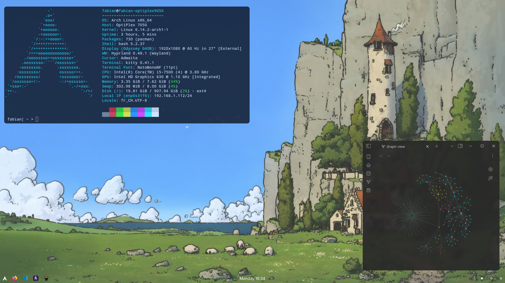

# Linux-Dotfiles
## Project Overview

This repository is a personal archive of the visual configurations (rices) I've created for various Linux setups.

Although this project is primarily for my own reference, I’ve made it public in case it can inspire or help others who are into ricing or experimenting with different Linux aesthetics. 
## Hyprland
### First (2025-04-14)

- Os : Arch
- WM : Hyprland
- Terminal : Kitty
- Bar : waybar
- App launcher : Wofi
- File Manager : Dolphin
- Fetch : fastfetch
- Wallpaper : [link](https://wallhaven.cc/w/m38g61)